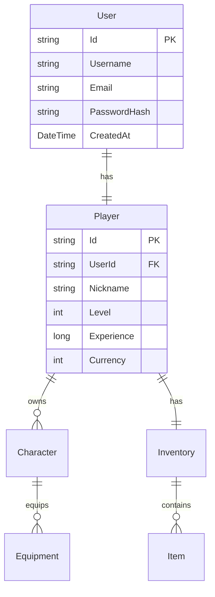

# SnowbreakTC Server 架构文档

## 项目概述

SnowbreakTC Server 是一个为《尘白禁区》(Snowbreak: Forbidden Zone) 打造的开源服务器模拟器，采用现代化的 .NET 8.0 技术栈和微服务架构设计。

## 架构设计原则

### 1. 分层架构 (Layered Architecture)
```
┌─────────────────────────────────────┐
│           Presentation Layer        │  ← Web API / Game Protocol
├─────────────────────────────────────┤
│           Application Layer         │  ← Business Logic Services
├─────────────────────────────────────┤
│             Domain Layer            │  ← Core Entities & Rules
├─────────────────────────────────────┤
│          Infrastructure Layer       │  ← Data Access & External
└─────────────────────────────────────┘
```

### 2. 依赖注入 (Dependency Injection)
- 使用 Microsoft.Extensions.DependencyInjection
- 接口与实现分离
- 便于单元测试和模块替换

### 3. 配置驱动 (Configuration-Driven)
- 支持多环境配置
- 热重载配置更新
- 环境变量覆盖

## 核心组件

### 1. SnowbreakTC.Server (主服务器)
**职责**: 应用程序入口点和服务协调
- 程序启动和生命周期管理
- 依赖注入容器配置
- 后台服务协调

**关键文件**:
- [`Program.cs`](../src/SnowbreakTC.Server/Program.cs) - 应用入口
- [`appsettings.json`](../src/SnowbreakTC.Server/appsettings.json) - 配置文件

### 2. SnowbreakTC.Core (核心库)
**职责**: 核心业务模型和接口定义
- 配置模型定义
- 服务接口声明
- 通用工具类

**关键组件**:
- `Configuration/` - 配置模型
- `Services/` - 服务接口
- `Models/` - 核心实体

### 3. SnowbreakTC.Database (数据访问层)
**职责**: 数据持久化和缓存管理
- MongoDB 数据访问
- Redis 缓存操作
- Repository 模式实现

**技术选型**:
- **MongoDB**: 文档数据库，适合游戏数据的灵活存储
- **Redis**: 内存缓存，用于会话和临时数据

### 4. SnowbreakTC.Protocol (协议层)
**职责**: 网络通信协议定义
- Protocol Buffers 消息定义
- 消息序列化/反序列化
- 网络包处理

**协议设计**:
```
[Header: 4 bytes] [Length: 4 bytes] [Command: 2 bytes] [Data: Variable]
```

### 5. SnowbreakTC.GameLogic (游戏逻辑)
**职责**: 游戏业务规则实现
- 玩家系统
- 角色管理
- 物品系统
- 战斗逻辑

### 6. SnowbreakTC.WebAPI (Web接口)
**职责**: HTTP API 管理接口
- RESTful API 设计
- 管理员功能
- 监控和统计

## 网络架构

### 双服务器模式
```
┌─────────────────┐    ┌─────────────────┐
│   Game Client   │    │  Admin Panel    │
└─────────┬───────┘    └─────────┬───────┘
          │                      │
          │ TCP (Game Protocol)  │ HTTP/HTTPS
          │                      │
┌─────────▼──────────────────────▼───────┐
│           SnowbreakTC Server           │
├────────────────┬───────────────────────┤
│  Game Server   │     Web API Server    │
│  (Port 22102)  │     (Port 8080)       │
└────────────────┴───────────────────────┘
```

### 通信流程
1. **游戏客户端** → TCP 连接 → **游戏服务器**
2. **管理面板** → HTTP 请求 → **Web API 服务器**
3. **两个服务器** → 共享数据库和缓存

## 数据模型

### 核心实体关系


## 安全设计

### 1. 认证授权
- JWT Token 认证
- BCrypt 密码哈希
- 会话管理

### 2. 数据保护
- 敏感数据加密存储
- 通信数据加密传输
- 输入验证和过滤

### 3. 访问控制
- 基于角色的权限控制
- API 访问限流
- 异常访问监控

## 性能优化

### 1. 缓存策略
- Redis 热数据缓存
- 内存缓存频繁访问数据
- 数据库查询优化

### 2. 连接管理
- 连接池管理
- 心跳机制
- 优雅断开连接

### 3. 异步处理
- async/await 模式
- 非阻塞 I/O 操作
- 后台任务处理

## 监控和日志

### 1. 日志系统
- 结构化日志记录
- 多级别日志输出
- 日志文件轮转

### 2. 性能监控
- 连接数统计
- 请求响应时间
- 资源使用情况

### 3. 健康检查
- 服务状态监控
- 数据库连接检查
- 自动故障恢复

## 扩展性设计

### 1. 水平扩展
- 无状态服务设计
- 负载均衡支持
- 分布式缓存

### 2. 模块化设计
- 插件式架构
- 功能模块独立
- 热插拔支持

### 3. 配置灵活性
- 环境特定配置
- 运行时配置更新
- 功能开关控制

## 部署架构

### 开发环境
```
Developer Machine
├── SnowbreakTC Server
├── MongoDB (Local)
├── Redis (Local)
└── Game Client (Test)
```

### 生产环境
```
Load Balancer
├── SnowbreakTC Server Instance 1
├── SnowbreakTC Server Instance 2
└── SnowbreakTC Server Instance N

Database Cluster
├── MongoDB Primary
├── MongoDB Secondary
└── Redis Cluster
```

## 技术债务和改进计划

### 短期目标
- [ ] 完善数据模型设计
- [ ] 实现基础游戏功能
- [ ] 添加单元测试覆盖

### 中期目标
- [ ] 性能优化和压力测试
- [ ] 安全加固和渗透测试
- [ ] 监控和告警系统

### 长期目标
- [ ] 微服务架构重构
- [ ] 容器化部署
- [ ] 自动化运维

## 参考资料

- [.NET 8.0 文档](https://docs.microsoft.com/en-us/dotnet/)
- [MongoDB 最佳实践](https://docs.mongodb.com/manual/administration/production-notes/)
- [Redis 性能优化](https://redis.io/topics/memory-optimization)
- [游戏服务器架构设计](https://www.gamedev.net/articles/programming/networking-and-multiplayer/1363/)