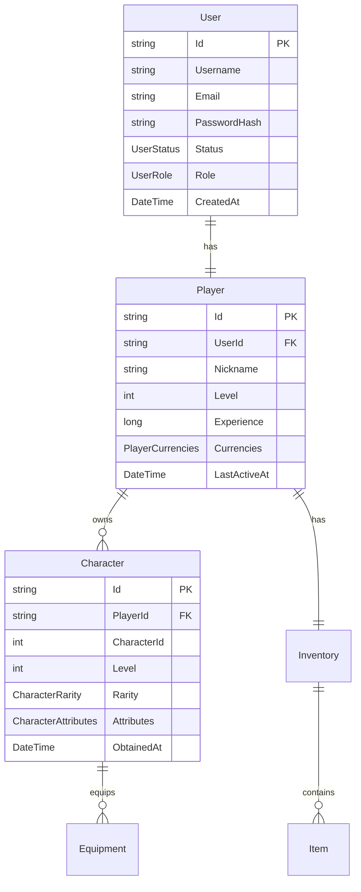

# SnowbreakTC Server 基础框架总结

## 🎯 项目概述

SnowbreakTC Server 是一个为《尘白禁区》(Snowbreak: Forbidden Zone) 打造的开源服务器模拟器基础框架。该框架采用现代化的 .NET 8.0 技术栈，实现了完整的分层架构和微服务设计模式。

## 🏗️ 架构设计

### 整体架构
```
┌─────────────────────────────────────────────────────────────┐
│                    SnowbreakTC Server                      │
├─────────────────────┬───────────────────────────────────────┤
│   Game Server       │         Web API Server               │
│   (TCP Protocol)    │         (HTTP/HTTPS)                 │
│   Port: 22102       │         Port: 8080                   │
└─────────────────────┴───────────────────────────────────────┘
                              │
                    ┌─────────┴─────────┐
                    │                   │
            ┌───────▼────────┐  ┌──────▼──────┐
            │    MongoDB     │  │    Redis    │
            │   (主数据库)    │  │   (缓存)    │
            └────────────────┘  └─────────────┘
```

### 项目结构
```
SnowbreakTC_Server/
├── src/
│   ├── SnowbreakTC.Server/              # 🚀 主服务器项目
│   ├── SnowbreakTC.Core/                # 🔧 核心库
│   ├── SnowbreakTC.Database/            # 💾 数据访问层
│   ├── SnowbreakTC.Protocol/            # 📡 协议定义
│   ├── SnowbreakTC.GameLogic/           # 🎮 游戏逻辑
│   └── SnowbreakTC.WebAPI/              # 🌐 Web API
├── tests/                               # 🧪 测试项目
├── docs/                               # 📚 文档
├── build.cmd                           # 🔨 构建脚本
└── SnowbreakTC.sln                     # 📋 解决方案文件
```

## ✅ 已实现功能

### 1. 基础设施层 (Infrastructure)
- ✅ **项目结构**: 完整的 Visual Studio 解决方案
- ✅ **配置系统**: 分层配置模型，支持环境特定配置
- ✅ **依赖注入**: Microsoft.Extensions.DependencyInjection
- ✅ **日志系统**: Serilog 结构化日志
- ✅ **构建工具**: 自动化构建脚本

### 2. 数据访问层 (Data Access)
- ✅ **MongoDB 集成**: 文档数据库支持
- ✅ **Redis 集成**: 内存缓存和会话管理
- ✅ **Repository 模式**: 通用仓储接口和实现
- ✅ **实体模型**: 用户、玩家、角色、物品等核心实体
- ✅ **索引优化**: 自动创建数据库索引

### 3. 业务逻辑层 (Business Logic)
- ✅ **服务接口**: 用户服务、玩家服务等业务接口
- ✅ **数据传输对象**: 请求/响应模型定义
- ✅ **业务规则**: 用户注册、登录、验证等核心逻辑框架

### 4. 表示层 (Presentation)
- ✅ **Web API 控制器**: RESTful API 接口
- ✅ **游戏协议**: TCP 消息定义和处理框架
- ✅ **双服务器架构**: HTTP API + TCP 游戏服务器

### 5. 安全机制 (Security)
- ✅ **密码哈希**: BCrypt 安全哈希
- ✅ **JWT 认证**: 访问令牌和刷新令牌
- ✅ **输入验证**: API 参数验证
- ✅ **会话管理**: Redis 会话存储

## 🔧 技术栈

### 后端框架
- **.NET 8.0** - 现代化开发框架
- **ASP.NET Core** - Web API 框架
- **Generic Host** - 后台服务管理

### 数据存储
- **MongoDB 6.0+** - 主数据库
- **Redis 7.0+** - 缓存和会话

### 网络通信
- **HTTP/HTTPS** - Web API 通信
- **TCP Socket** - 游戏协议通信
- **JSON** - 消息序列化

### 开发工具
- **Serilog** - 结构化日志
- **xUnit** - 单元测试框架
- **Swagger** - API 文档

## 📊 数据模型设计

### 核心实体关系


### 实体特性
- **软删除**: 所有实体支持软删除机制
- **审计跟踪**: 创建时间、更新时间、操作者记录
- **乐观锁**: 版本号控制并发更新
- **索引优化**: 自动创建查询优化索引

## 🌐 API 设计

### RESTful API 端点
```
POST   /api/users/register          # 用户注册
POST   /api/users/login             # 用户登录
GET    /api/users/me                # 获取当前用户信息
GET    /api/users/check-username    # 检查用户名可用性
GET    /api/users/check-email       # 检查邮箱可用性
```

### 游戏协议消息
```
1001 - Handshake        # 握手连接
1002 - Heartbeat        # 心跳保持
2001 - Login            # 游戏登录
3001 - GetPlayerInfo    # 获取玩家信息
4001 - GetCharacterList # 获取角色列表
5001 - EnterBattle      # 进入战斗
```

## 🚀 快速开始

### 环境要求
- .NET 8.0 SDK
- MongoDB 6.0+
- Redis 7.0+
- Visual Studio 2022 或 VS Code

### 构建和运行
```bash
# 1. 克隆项目
git clone <repository-url>
cd SnowbreakTC_Server

# 2. 还原依赖
dotnet restore

# 3. 构建项目
dotnet build

# 4. 运行服务器
dotnet run --project src/SnowbreakTC.Server
```

### 服务访问
- **游戏服务器**: `localhost:22102` (TCP)
- **Web API**: `http://localhost:8080` (HTTP)
- **API 文档**: `http://localhost:8080/swagger` (开发环境)

## 📈 性能特性

### 可扩展性
- **水平扩展**: 无状态服务设计
- **负载均衡**: 支持多实例部署
- **缓存策略**: Redis 热数据缓存

### 性能优化
- **异步编程**: 全面使用 async/await
- **连接池**: 数据库连接池管理
- **索引优化**: 自动创建查询索引

### 监控和诊断
- **结构化日志**: Serilog 日志记录
- **健康检查**: 服务状态监控
- **性能计数器**: 连接数、响应时间统计

## 🔮 后续开发计划

### 短期目标 (1-2 周)
- [ ] 完善用户服务实现
- [ ] 实现玩家数据管理
- [ ] 添加角色系统功能
- [ ] 完善游戏协议处理

### 中期目标 (1-2 月)
- [ ] 实现战斗系统
- [ ] 添加物品和仓库管理
- [ ] 实现抽卡系统
- [ ] 完善安全机制

### 长期目标 (3-6 月)
- [ ] 性能优化和压力测试
- [ ] 微服务架构重构
- [ ] 容器化部署
- [ ] 自动化运维

## 🤝 贡献指南

### 开发规范
- 遵循 C# 编码规范
- 使用 XML 文档注释
- 编写单元测试
- 提交前运行代码检查

### 提交流程
1. Fork 项目仓库
2. 创建功能分支
3. 实现功能并测试
4. 提交 Pull Request

## 📄 许可证

本项目采用 [GNU Affero General Public License v3.0](../LICENSE) 许可证。

## 🙏 致谢

- 感谢 **西山居 (Seasun Games)** 开发的《尘白禁区》
- 感谢开源社区提供的优秀工具和框架
- 感谢所有贡献者的努力和支持

---

**注意**: 本项目仅用于学习和研究目的，请勿用于商业用途。使用前请仔细阅读许可证条款。